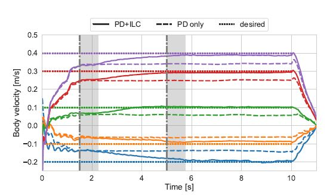

In this project with the CoRoLab at the Berlin University of Applied Science and Technology, I helped investigate a control strategy that combined Proportional-Derivative (PD) control with Iterative Learning Control (ILC) to enhance legged robot velocity control. The first step was deriving a first principles, kinematic model of the Unitree Go1. Using the inverse kinematics equations derived from this allowed us to control individual foot positions in reference to the shoulder (hip) joints, forming the basis of the control strategy. 

Reference foot trajectories were obtained using Bezier Curves.

$$
    B(t) = \sum_{i=0}^{n} \binom{n}{i} (1-t)^{n-i} t^i P_i
$$

Using PD Control, each foot is able follow these step trajectories, resulting in a trotting gait. However, PD turned out to not be satisfactory for performance, with the Go1 being unable to accurately follow desired trotting speeds. To improve upon this, we integrated ILC, which traditionally was only used for fixed robots such as robotic arms. The architecture for the PD-ILC method can be found below

Finally, with both the PD-ILC we were able to obtain good performance with velocity errors diminishing to under 5% after the ILC has kicked in. 

And a video of the initial performance!
<video width="640" height="360" controls>
  <source src="assets/go1_walk.mov" type="video/quicktime">
</video>